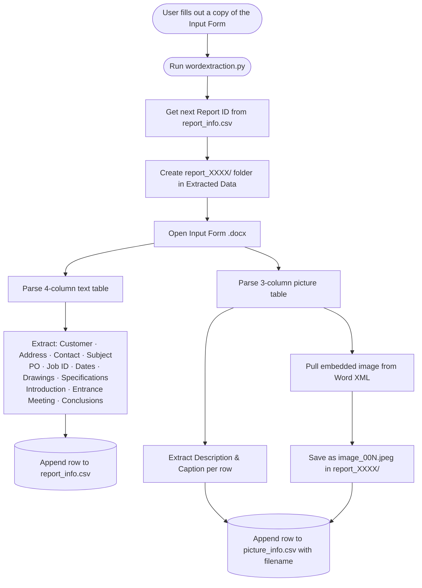
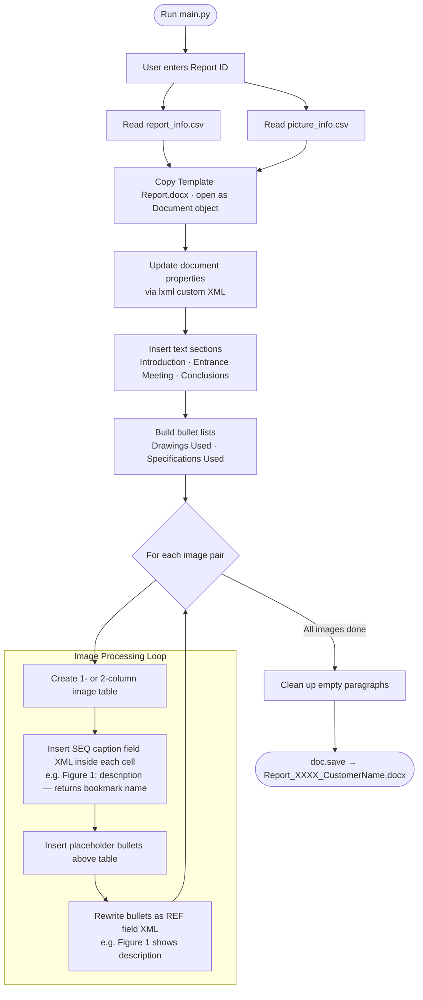

# Report Automation

Automates the generation of professional Word inspection reports for Maverick Applied Science. A user fills out a data-entry form, and the system produces a formatted, publication-ready `.docx` report.

## Requirements

- Python 3.x
- Dependencies: `pip install -r requirements.txt`

## Setup

Copy `.env.example` to `.env` and update the four paths to match your local directories:

```
TEMPLATE_DOC_PATH          → path to Templates/Template Report.docx
OUTPUT_REPORT_FOLDER_PATH  → path to Output Report/ folder
INPUT_DOC_PATH             → path to your filled-in input form
EXTRACTED_DATA_PATH        → path to Reports Extracted Data/ folder
```

## How to Use

The workflow has two stages.

### Stage 1 — Fill Out the Input Form

> **Important:** Never edit `Templates/Template Report Inputs Form.docx` directly. Always make a copy first.

Make a copy of `Templates/Template Report Inputs Form.docx`, give it a descriptive name (e.g., `Acme Corp Boiler Inspection 2026-05.docx`), and save it to `Report Input Forms/`. Fill in the copy:

- **4-column table** — customer name, address, contact, subject, PO number, job ID, inspection dates, drawings used, specifications used, and text for the Introduction, Entrance Meeting, and Conclusions sections.
- **3-column table** — one row per image: description, caption, and an embedded image.

Save the completed form to `Report Input Forms/` under any name you like.

### Stage 2 — Extract Data

Run the extraction script to parse the form and save the data:

```bash
python wordextraction.py
```

This creates:
- `Reports Extracted Data/report_info.csv` — report metadata
- `Reports Extracted Data/picture_info.csv` — image metadata
- `Reports Extracted Data/report_XXXX/` — extracted image files

Each run assigns the next sequential Report ID.

### Stage 3 — Generate the Report

Run the main script and enter the Report ID when prompted:

```bash
python main.py
```

The output report is saved to `Output Report/Report_XXXX_CustomerName.docx`.

## Project Structure

```
report-automation/
├── main.py                          # Report generation orchestrator
├── utils.py                         # Document manipulation helpers
├── wordextraction.py                # Input form parser
├── requirements.txt
├── .env                             # Local path configuration (not tracked)
├── .env.example                     # Template for .env
│
├── Templates/
│   ├── Template Report.docx         # Master output template
│   ├── Template Report Inputs Form.docx  # Data-entry form template
│   └── Example Report.docx          # Reference example
│
├── Report Input Forms/              # Place completed input forms here
├── Reports Extracted Data/          # CSVs and extracted images (auto-generated)
└── Output Report/                   # Final reports (auto-generated)
```

## How It Works

All document manipulation is done entirely with **python-docx** and direct OOXML construction via **lxml** — no Microsoft Word or COM automation required. Figure captions use `SEQ Figure \* ARABIC` field codes and cross-references use `REF _Ref_Fig_N \h \* Charformat` field codes, both hand-crafted as XML elements. Word auto-updates these fields when the document is opened.

### `wordextraction.py` — Data Extraction Flow



### `main.py` — Report Generation Flow


